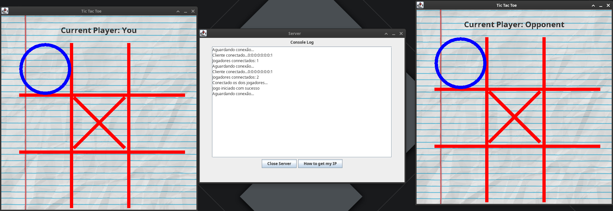

# JOX
Play Tic Tac Toe online using Java

## Features

* Create a TCP server for players to join.
* Console Log to see the game activity in real-time.
* Login into a game and play against other opponents.
* Multithread.

## Requirements

* Java 

# License
[MIT](https://choosealicense.com/licenses/mit/)
